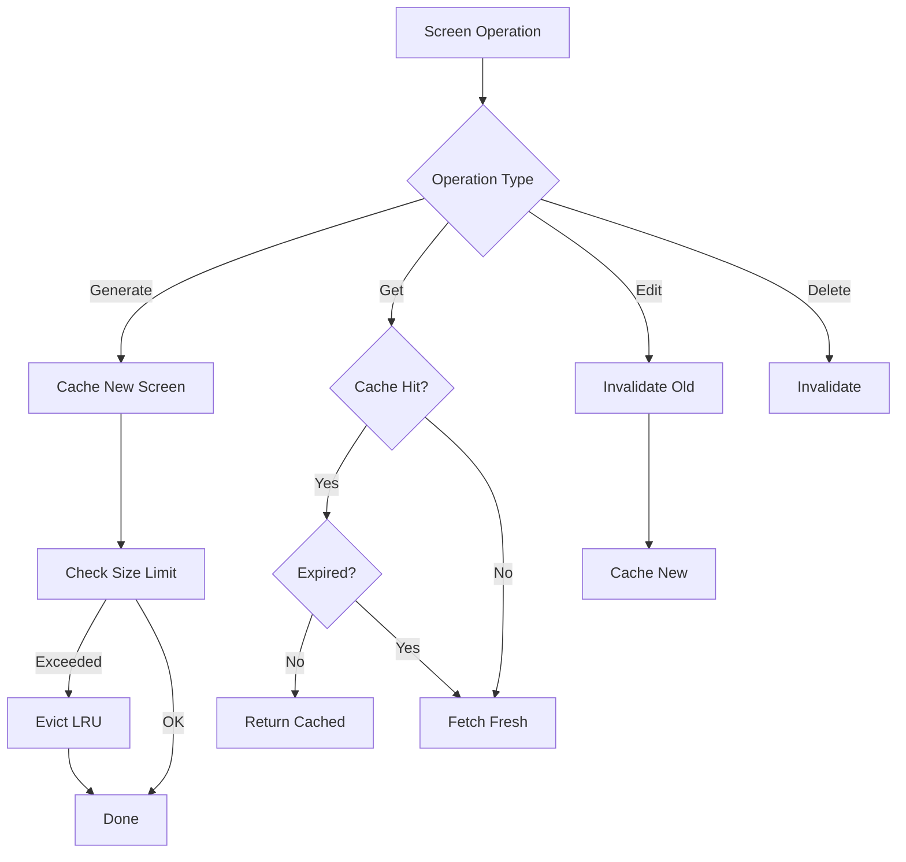

# ScreenCacheService

IndexedDB-based caching service for Stitch-generated screens, providing offline access and improved performance.

## Overview

The `ScreenCacheService` implements persistent client-side caching for generated screens using IndexedDB. This enables:

- **Offline Access**: View previously generated screens without network connectivity
- **Performance**: Reduce network requests by serving cached screens
- **Resilience**: Continue working during temporary connection issues

## Features

### 1. Automatic Caching

Screens are automatically cached when:
- Generated via `generateScreen()`
- Retrieved via `getScreen()`
- Listed via `listScreens()`
- Edited via `editScreens()`
- Generated as variants via `generateVariants()`

### 2. Cache Invalidation Strategies

#### Age-Based Invalidation
- Default: 7 days
- Configurable via `maxCacheAge` property
- Expired entries are automatically filtered out on retrieval

#### Size-Based Invalidation (LRU)
- Default: 100 entries
- Configurable via `maxCacheSize` property
- Least Recently Used (LRU) entries are evicted when limit is reached

#### Manual Invalidation
- `invalidateScreen(screenId)`: Remove specific screen
- `invalidateProject(projectId)`: Remove all screens for a project
- `clearExpiredEntries()`: Remove all expired entries
- `clearAll()`: Clear entire cache

### 3. Offline Support

When offline, the service:
- Returns cached screens if available
- Filters out expired entries
- Tracks last accessed time for LRU eviction

## Usage

### Basic Usage (via MCPClientService)

The `MCPClientService` automatically integrates with `ScreenCacheService`:

```javascript
import MCPClientService from './services/MCPClientService';

const mcpClient = new MCPClientService();

// Connect to server
await mcpClient.connect('http://localhost:3000');

// Generate a screen (automatically cached)
const screen = await mcpClient.generateScreen({
  projectId: 'my-project',
  prompt: 'Create a dashboard page',
  deviceType: 'DESKTOP'
});

// Get a screen (uses cache if available)
const cachedScreen = await mcpClient.getScreen({
  projectId: 'my-project',
  screenId: 'screen-123',
  useCache: true  // default: true
});

// Force fresh fetch from server
const freshScreen = await mcpClient.getScreen({
  projectId: 'my-project',
  screenId: 'screen-123',
  useCache: false
});
```

### Direct Usage

For advanced use cases, you can use `ScreenCacheService` directly:

```javascript
import ScreenCacheService from './services/ScreenCacheService';

const cacheService = new ScreenCacheService();

// Initialize the database
await cacheService.init();

// Cache a screen
await cacheService.cacheScreen({
  id: 'screen-123',
  projectId: 'project-456',
  name: 'DashboardPage',
  code: '<div>Dashboard content</div>',
  metadata: { framework: 'react' }
});

// Retrieve a cached screen
const screen = await cacheService.getCachedScreen('screen-123');

// Get all screens for a project
const projectScreens = await cacheService.getCachedScreensByProject('project-456');

// Invalidate a screen
await cacheService.invalidateScreen('screen-123');

// Clear expired entries
const clearedCount = await cacheService.clearExpiredEntries();

// Get cache statistics
const stats = await cacheService.getCacheStats();
console.log(`Cache has ${stats.validEntries} valid entries, ${stats.expiredEntries} expired`);
```

### Cache Management

```javascript
// Check if caching is enabled
if (mcpClient.isCacheEnabled()) {
  console.log('Screen caching is active');
}

// Disable caching
mcpClient.setCacheEnabled(false);

// Re-enable caching
mcpClient.setCacheEnabled(true);

// Get cache statistics
const stats = await mcpClient.getCacheStats();
console.log(`Total size: ${stats.totalSize} bytes`);
console.log(`Valid entries: ${stats.validEntries}`);
console.log(`Expired entries: ${stats.expiredEntries}`);

// Clear all cached screens
await mcpClient.clearScreenCache();

// Clear only expired entries
const clearedCount = await mcpClient.clearExpiredCache();
console.log(`Cleared ${clearedCount} expired entries`);
```

### Configuration

```javascript
const cacheService = new ScreenCacheService();

// Customize cache age (3 days instead of 7)
cacheService.maxCacheAge = 3 * 24 * 60 * 60 * 1000;

// Customize cache size (50 entries instead of 100)
cacheService.maxCacheSize = 50;

await cacheService.init();
```

## Data Structure

### Cached Screen Entry

```typescript
interface CachedScreen {
  id: string;              // Screen ID
  projectId: string;       // Project ID
  name: string;            // Screen name
  code: string;            // Generated code
  metadata: object;        // Screen metadata
  prompt?: string;         // Generation prompt
  variant_of?: string;     // Parent screen ID (for variants)
  timestamp: number;       // Cache creation time
  lastAccessed: number;    // Last access time (for LRU)
}
```

## IndexedDB Schema

### Database
- **Name**: `StitchScreenCache`
- **Version**: 1

### Object Store
- **Name**: `screens`
- **Key Path**: `id`

### Indexes
- `projectId`: For project-based queries
- `timestamp`: For age-based invalidation
- `lastAccessed`: For LRU eviction

## Cache Invalidation Flow



## Performance Considerations

### Benefits
- **Reduced Network Requests**: Cached screens load instantly
- **Offline Capability**: Work without internet connection
- **Bandwidth Savings**: Avoid re-downloading large code files

### Trade-offs
- **Storage Space**: IndexedDB uses browser storage quota
- **Stale Data**: Cached screens may be outdated
- **Memory Usage**: Large cache increases memory footprint

### Best Practices

1. **Regular Cleanup**: Periodically clear expired entries
   ```javascript
   setInterval(async () => {
     await mcpClient.clearExpiredCache();
   }, 24 * 60 * 60 * 1000); // Daily
   ```

2. **Monitor Cache Size**: Check statistics regularly
   ```javascript
   const stats = await mcpClient.getCacheStats();
   if (stats.totalSize > 10 * 1024 * 1024) { // 10MB
     console.warn('Cache size exceeds 10MB');
   }
   ```

3. **Invalidate on Edit**: Always invalidate when screens are modified
   ```javascript
   // Automatically handled by MCPClientService
   await mcpClient.editScreens({...});
   ```

4. **Use Cache Wisely**: Disable for real-time collaboration
   ```javascript
   // Disable cache for live editing sessions
   mcpClient.setCacheEnabled(false);
   ```

## Browser Compatibility

IndexedDB is supported in all modern browsers:
- Chrome 24+
- Firefox 16+
- Safari 10+
- Edge 12+

Check support before using:
```javascript
if (ScreenCacheService.isSupported()) {
  // Use caching
} else {
  console.warn('IndexedDB not supported, caching disabled');
}
```

## Error Handling

The service handles errors gracefully:

```javascript
try {
  await cacheService.cacheScreen(screen);
} catch (error) {
  console.error('Failed to cache screen:', error);
  // Continue without caching
}
```

Errors are logged but don't interrupt normal operation. If caching fails, the application continues to work with fresh data from the server.

## Testing

Run tests with:
```bash
npm test -- ScreenCacheService.test.js
```

The test suite verifies:
- API surface and method signatures
- Configuration options
- Data structure validation
- Cache invalidation strategies
- IndexedDB integration

## Requirements

Implements requirement **15.5** from the Stitch UI Integration spec:
- ✅ IndexedDB caching for generated screens
- ✅ Cache screens for offline access
- ✅ Cache invalidation strategy (age-based + size-based LRU)

## See Also

- [MCPClientService](./MCPClientService.IMPLEMENTATION.md) - Main MCP client with integrated caching
- [Design Document](./.kiro/specs/stitch-ui-integration/design.md) - Overall architecture
- [Requirements](./.kiro/specs/stitch-ui-integration/requirements.md) - Detailed requirements
