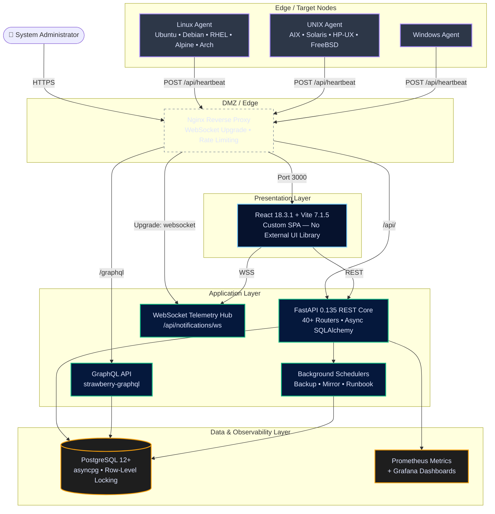
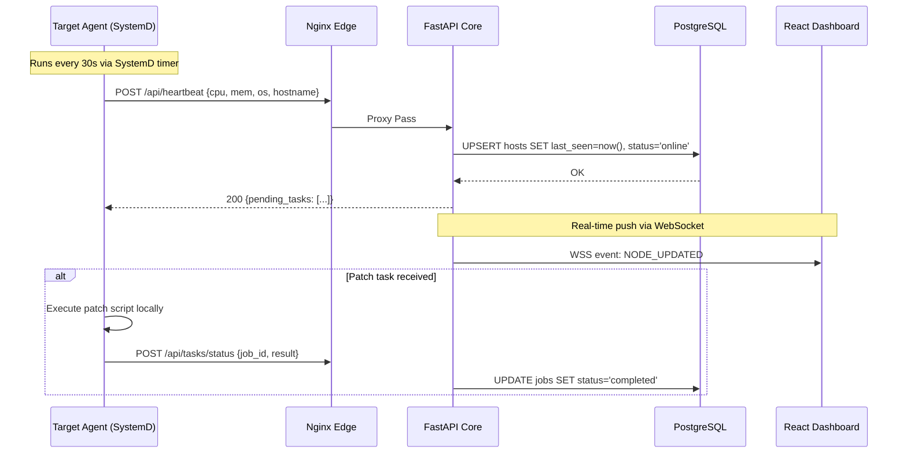

<div align="center">

# 🛡️ PatchMaster Enterprise
### *by VYGROUP*

**Next-Generation, High-Availability Patch Management & Infrastructure Telemetry Platform**

<br/>

[](https://github.com/patchmastertool-ai/patchmaster)
[]()
[]()
[]()
[]()
[]()
[]()

<br/>

*A zero-trust, air-gap resilient infrastructure command center — enabling centralized control, real-time WebSocket telemetry, and secure patch deployment orchestration across heterogeneous enterprise server fleets.*

</div>

---

## 📖 Executive Overview

Managing highly distributed, heterogeneous, and secure environments demands more than standard package managers. **PatchMaster Enterprise** is a purpose-built infrastructure command center that unifies deployment strategies, mitigates system fragmentation, and enforces rigorous compliance policies globally — all from a single, license-gated administrative dashboard.

Engineered from the ground up to operate on both standard cloud topologies and **fully air-gapped, dark-site deployments**, the platform employs a proprietary offline dependency bundling strategy. This allows PatchMaster to securely deliver mission-critical patches to completely isolated systems with zero exposure to external threat vectors.

---

## 🏛️ Advanced System Architecture

### 1. High-Level Topology

PatchMaster uses a deeply decoupled, service-oriented architecture with asynchronous I/O throughout.



### 2. Heartbeat & Telemetry Flow

Agents use a strict **outbound-only** polling model, eliminating the need for inbound firewall rules on target nodes.



### 3. Backend API Surface (Verified from `main.py`)

The FastAPI application mounts **40+ routers** covering the entire platform surface:

| Domain | Router | Description |
|---|---|---|
| Auth | `auth_api`, `ldap_auth`, `oidc_auth` | JWT, LDAP/AD, OIDC/OAuth2 (Okta, Azure AD, Google, Keycloak) |
| Agents | `register_v2`, `agent_proxy`, `agent_update` | Agent registration, heartbeat proxy, remote update delivery |
| Hosts | `hosts_v2`, `host_timeline`, `groups`, `tags` | Fleet management, history, group/tag organization |
| Patching | `jobs_v2`, `bulk_patch`, `canary_testing`, `ring_rollout` | Job dispatch, bulk ops, canary phased rollout |
| Repos | `packages_router`, `mirror_repos` | Local package repo, mirror sync |
| Security | `cve`, `compliance`, `remediation`, `hooks` | CVE tracking, compliance audit, pre/post patch hooks |
| CI/CD | `cicd`, `cicd_secrets`, `cicd_agent_targets`, `git_integration` | Full pipeline builder, encrypted secrets, Git integration |
| Ops | `ops_queue`, `schedules`, `maintenance`, `sla`, `runbook` | Queue management, scheduling, maintenance windows |
| Infrastructure | `backups`, `provisioning`, `network_boot`, `restore_drills` | Backup/recovery, PXE boot, disaster drill automation |
| Observability | `monitoring`, `metrics`, `prometheus_targets`, `drift_detector` | Prometheus targets, drift detection, Grafana integration |
| Platform | `license_router`, `reports`, `dashboard`, `search`, `plugins` | License enforcement, reports, global search, plugin integrations |
| GraphQL | `graphql` (strawberry-graphql) | Schema-first GraphQL read API |

### 4. Frontend Architecture (Verified from `frontend/src/`)

A **fully hand-crafted React 18.3.1 + Vite 7.1.5 SPA** — zero reliance on external UI component libraries. Every component, icon, layout, and design token is built in-house.

```
frontend/src/
├── App.jsx                   # Root: auth, RBAC routing, sidebar nav, 35+ lazy pages (4,074 lines)
├── App.css                   # Entire design system: tokens, layout, dark mode, components (~36KB)
├── appRuntime.js             # API client, JWT store, RBAC helpers, WebSocket URL builder
├── AppIcons.jsx              # Custom SVG icon library — no icon font dependency
├── ToastSystem.jsx           # React Context global toast notification system
│
├── DashboardOpsPage.jsx      # Live system health, host stats, job activity feed
├── HostsOpsPage.jsx          # Full host fleet management (~42KB)
├── PatchManagerOpsPage.jsx   # Patch orchestration and job management (~42KB)
├── CVEOpsPage.jsx            # CVE tracker with severity heatmap (~28KB)
├── CICDOpsPage.jsx           # Full CI/CD visual pipeline builder (~115KB)
├── NetworkBootPage.jsx       # PXE / network boot orchestration (~60KB)
├── MirrorRepoOpsPage.jsx     # Repo mirror management (~41KB)
├── MonitoringOpsPage.jsx     # Prometheus metrics & embedded Grafana
├── UsersOpsPage.jsx          # User & RBAC administration (~31KB)
└── ... 25+ more production pages
```

**Verified frontend capabilities:**

| Capability | Implementation Detail |
|---|---|
| Auth | JWT + SSO URL-fragment callback + Active Directory/LDAP modal |
| Dark Mode | `data-theme` DOM attribute, persisted to `localStorage` |
| Global Search | `Ctrl+K` shortcut, 300ms debounced across hosts, CVEs, jobs |
| Navigation | License feature-flag + RBAC gated sidebar — 35+ pages |
| Notifications | WebSocket push (`/api/notifications/ws`) + 30s polling fallback |
| Error Handling | Per-page `<ErrorBoundary>` + `React.Suspense` lazy-load fallbacks |
| Code Splitting | All pages via `React.lazy()` — only loaded on navigation |
| License Enforcement | Client-side feature gating from `/api/license/status` response |

### 5. Database Architecture & Concurrency

| Pattern | Detail |
|---|---|
| **ORM** | SQLAlchemy 2.0 async with `asyncpg` driver |
| **Row-Level Locking** | `SELECT ... FOR UPDATE SKIP LOCKED` for deadlock-free task dispatch |
| **Connection Pooling** | `pool_size=100` to handle thousands of simultaneous agent heartbeats |
| **Migrations** | Managed via `backend/migrations/` |
| **Multi-tenancy** | `MultiTenantMiddleware` for tenant-isolated data access |

---

## 🔒 Vendor Strategy & Air-Gapped Support

The `./vendor/` directory implements a **local PyPI mirror** strategy:

- **Pre-Compiled Wheels** in `./vendor/vendor/wheels/` — Flask, PyYAML, psutil, prometheus_client, requests, and all transitive dependencies bundled as verified `.whl` binaries.
- **Zero Internet Required** — agent installation never reaches out to external package indexes. All dependencies resolved from local wheels only.
- **Self-Contained Packages** — agent installers (~35MB) include a fully provisioned Python virtual environment, enabling deployment into classified, dark-site, or air-gapped environments.

---

## 🚀 Key Capabilities

### 🚦 Canary Testing & Ring Rollout
`backend/api/canary_testing.py` + `backend/api/ring_rollout.py`
- Deploy to a configurable host subset first, monitor telemetry, then auto-promote or suspend.
- Ring-based rollout model (Ring 0 → Ring N) with per-ring delay windows.

### 🔐 Multi-Layer Security Middleware
All enforced server-side via middleware stack in `main.py`:
- **LicenseMiddleware** — blocks unlicensed API paths at the application layer.
- **MultiTenantMiddleware** — enforces tenant data isolation.
- **slowapi Rate Limiting** — protects against brute-force and DDoS.
- **Security Headers** — `X-Content-Type-Options`, `Strict-Transport-Security`, full `Content-Security-Policy`, `Referrer-Policy`, `Permissions-Policy` on every response.

### 🔑 Enterprise SSO & Identity
- **Local Auth** — bcrypt-hashed passwords via `passlib`.
- **LDAP / Active Directory** — optional `ldap3` integration.
- **OIDC / OAuth2** — Okta, Azure AD, Google Workspace, Keycloak via `authlib`.
- **JWT** — stateless tokens via `PyJWT 2.10.1`, 60-minute expiry.

### 🧬 GraphQL API
Full read API via `strawberry-graphql` mounted at `/graphql` — for BI tools, dashboards, and third-party integrations.

### 🗂️ Pure-Python Git Integration
`dulwich` provides a pure-Python Git implementation for the PatchRepo feature — enabling Git-backed patch content storage without requiring a system-level `git` binary.

---

## ⚙️ Deployment Matrix

<details>
<summary><b>🐳 Option A: Docker High Availability</b> <i>(Recommended for Production)</i></summary>
<br/>

```bash
docker-compose -f docker-compose.ha.yml up -d
```

Deploys 3 load-balanced FastAPI replicas, PostgreSQL, Nginx, and Prometheus in isolated networks.
</details>

<details>
<summary><b>💻 Option B: Bare-Metal (SystemD)</b></summary>
<br/>

```bash
tar -xzf patchmaster-2.0.17.tar.gz && cd patchmaster-2.0.17
sudo bash auto-setup.sh
```

Bootstraps Nginx, PostgreSQL, and the FastAPI backend as SystemD services.
</details>

<details>
<summary><b>🤖 Option C: Agent Compilation (Agent v2.0.1)</b></summary>
<br/>

```bash
cd agent
bash build-all-fixed.sh 2.0.1   # All platforms (agent stays v2.0.1)
bash build-deb-fixed.sh          # Ubuntu/Debian (.deb)
bash build-rpm.sh                # RHEL/CentOS (.rpm)
```
</details>

---

## 🛠️ Diagnostics & Troubleshooting

| Script | Target | Purpose |
|---|---|---|
| `./diagnose_agent_issues.sh` | Controller | Full health probe — PostgreSQL, FastAPI, SystemD, agent counts |
| `./fix_websocket_and_groups.sh` | Nginx Edge | Repairs `Upgrade $http_upgrade` WebSocket proxy headers |
| `./fix_agent_registration.sh` | Target Node | Resets local agent state and forces controller handshake |
| `./test_frontend_backend.sh` | Controller | End-to-end integration tests verifying API contract integrity |

---

## 🛡️ Security Posture

- **RBAC** — role + permission-scoped API and UI access.
- **JWT** — stateless, 60-minute expiry, bcrypt-protected at rest.
- **Rate Limiting** — `slowapi` guards against brute-force on auth endpoints.
- **Full Security Headers** — HSTS, CSP, X-Frame-Options, Permissions-Policy on all responses.
- **Cryptographic Secrets** — PostgreSQL and Grafana passwords generated via `secrets.token_hex(8)`.
- **CVE Hardening** — 30-password denylist, sanitized DB inputs, typed exception handling throughout.

---

## 📦 Verified Dependency Versions

### Backend (`backend/requirements.txt`)

| Package | Version | Purpose |
|---|---|---|
| `fastapi` | 0.135.1 | Async REST API framework |
| `uvicorn` | 0.41.0 | ASGI server |
| `pydantic` | 2.12.5 | Data validation & serialization |
| `sqlalchemy[asyncio]` | 2.0.48 | ORM with async engine |
| `asyncpg` | 0.30.0 | PostgreSQL async driver |
| `PyJWT` | 2.10.1 | JWT token auth |
| `passlib[bcrypt]` | 1.7.4 | Password hashing |
| `bcrypt` | 5.0.0 | Bcrypt hashing library |
| `prometheus-client` | 0.24.1 | Metrics exposition |
| `authlib` | 1.3.2 | OIDC/OAuth2 SSO |
| `slowapi` | 0.1.9 | Rate limiting |
| `strawberry-graphql` | ≥0.217.0 | GraphQL API |
| `dulwich` | ≥0.25.0 | Pure-Python Git (PatchRepo) |
| `cryptography` | ≥42.0.0 | Cryptographic operations |
| `pandas` | 2.3.2 | Report generation |
| `psutil` | 7.2.2 | System metrics |

### Frontend (`frontend/package.json`)

| Package | Version | Purpose |
|---|---|---|
| `react` | 18.3.1 | UI framework |
| `react-dom` | 18.3.1 | DOM renderer |
| `vite` | 7.1.5 | Build tool & dev server |
| `@vitejs/plugin-react` | 5.0.2 | React + Vite integration |
| `@playwright/test` | 1.49.0 | End-to-end testing |
| `markdown-it` | 14.1.1 | Markdown rendering |

### Infrastructure

| Component | Version | Notes |
|---|---|---|
| PostgreSQL | 12+ | Primary database |
| Nginx | Latest stable | Reverse proxy + WebSocket |
| Prometheus | Latest | Metrics collection |
| Grafana | Latest | Metrics visualization |
| Python | 3.8+ (server) / 3.12+ (build) | Runtime |

---

## 📚 Documentation

| Document | Description |
|---|---|
| [Release Notes v2.0.17](RELEASE_NOTES_2.0.1.md) | WebSocket fixes, agent registration improvements, security hardening |
| [Offline Agent Installation](OFFLINE_AGENT_INSTALLATION.md) | Deploying to air-gapped / dark-site environments |
| [Deployment Fixes & Runbooks](DEPLOYMENT_FIXES.md) | Operational troubleshooting and remediation steps |
| [Installation Notes](INSTALLATION_NOTES.md) | Full server setup guide |

---

<br/>

<div align="center">

---

### ⚠️ Proprietary & Confidential

This software and all associated source code, documentation, configurations, and assets are the **exclusive private property of the PatchMaster Team and its Respected Owner**.

Unauthorized copying, redistribution, modification, reverse engineering, or commercial use of any part of this codebase — in whole or in part — is **strictly prohibited** without prior written consent from the owner.

All rights reserved. © 2026 PatchMaster by VYGROUP.

---

**Built with ❤️ by the PatchMaster Engineering Team**

[](https://www.linkedin.com/in/yash-kumar-dubey-4b4926253/)

*Enterprise IT Infrastructure Modernization | Proprietary Software*

</div>