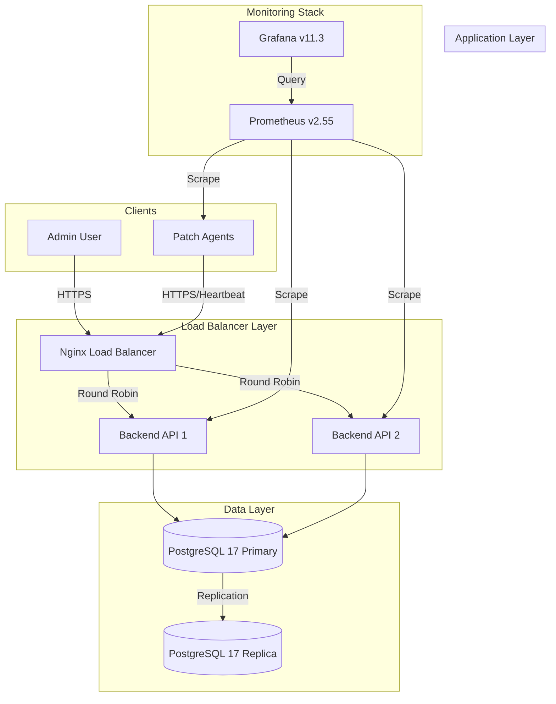
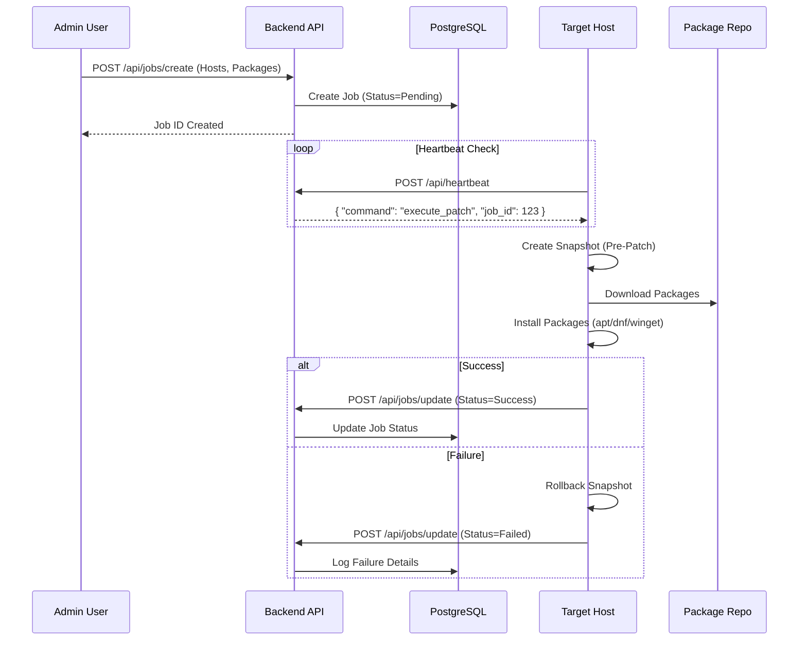
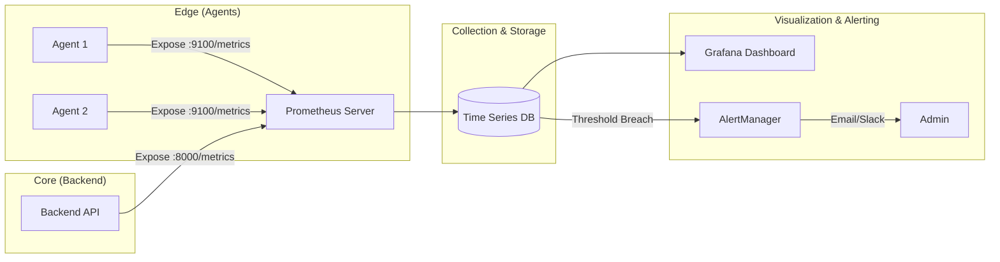

# PatchMaster System Architecture & Workflows

## 1. High-Level Architecture (HA Deployment)

This diagram illustrates the **Active-Active** deployment model, suitable for production environments requiring fault tolerance and scalability.

---

## 2. Patch Execution Workflow

The end-to-end process from initiating a patch job to final verification.

---

## 3. Monitoring & Alerting Pipeline

How metrics flow from the edge to the dashboard.

---
