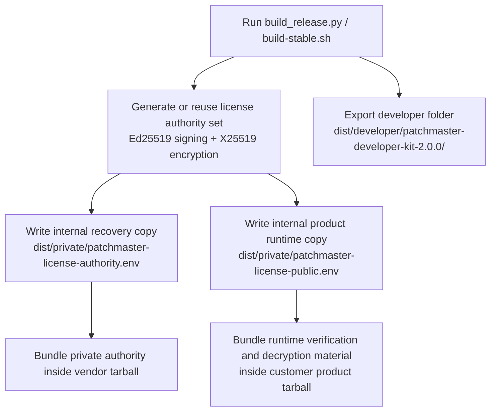
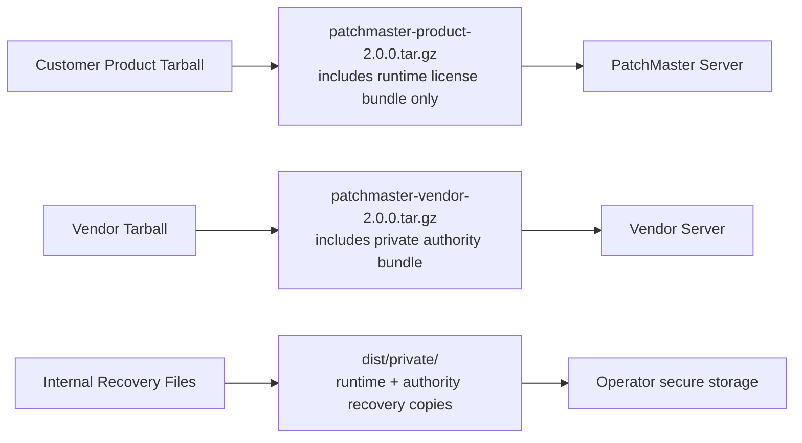
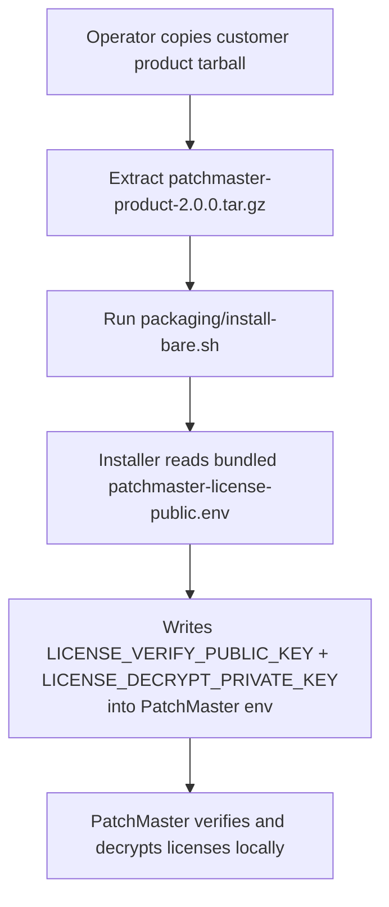
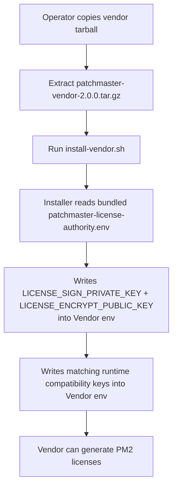
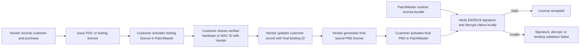
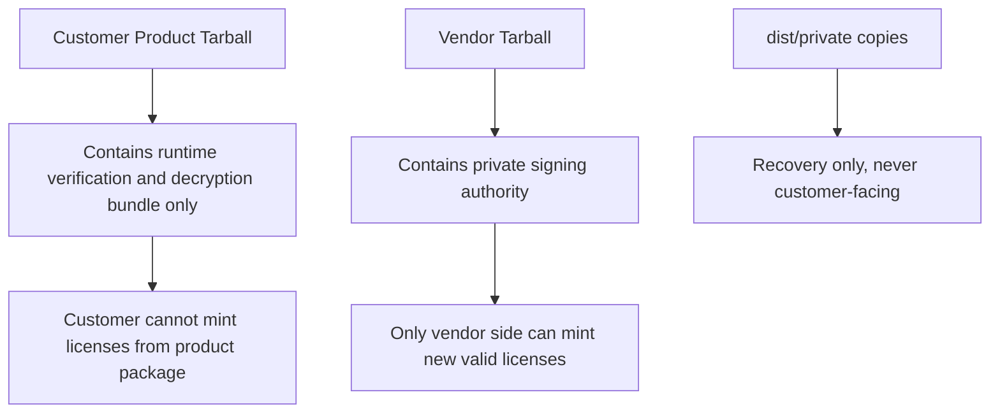
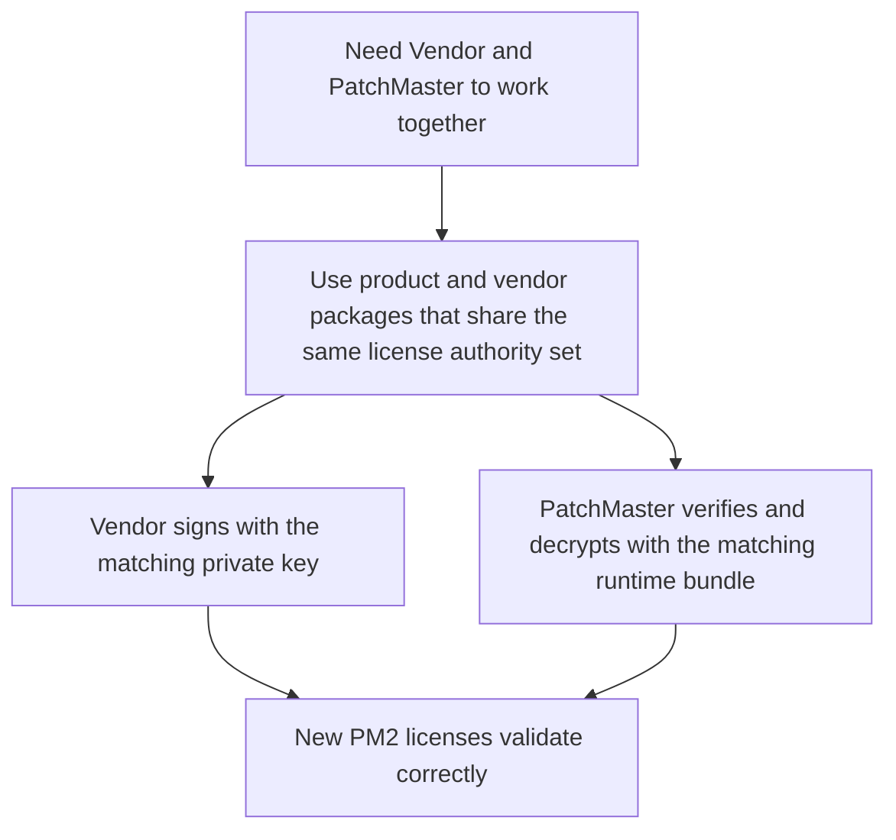
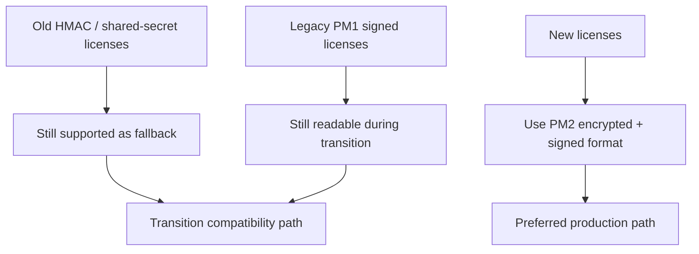

# PatchMaster Internal License And Release Architecture

## 1. Build And Artifact Flow

## 2. What Goes Where

## 3. PatchMaster Install Flow

## 4. Vendor Install Flow

## 5. Runtime License Flow

### Runtime Clarification
- PatchMaster verifies and decrypts the license locally with its bundled runtime license material.
- Customer POC or testing happens on the customer side before the final bound license is generated.
- Vendor records the customer hardware or MAC ID in the Vendor portal and uses that stored binding ID for final license generation.
- Vendor public internet exposure is not required for PatchMaster license verification.

## 6. Trust Boundary

## 7. Safe Usage Rule

## 8. Transition Compatibility

## Internal Operator Instructions

### Recommended Internal Deployment
1. Build artifacts with `bash scripts/build-stable.sh`
2. Keep `dist/private/patchmaster-license-authority.env` private
3. Deliver `dist/patchmaster-product-2.0.0.tar.gz` to the PatchMaster server
4. Deliver `vendor/dist/patchmaster-vendor-2.0.0.tar.gz` to the Vendor server
5. Install PatchMaster with `bash packaging/install-bare.sh --with-monitoring`
6. Install Vendor with `bash install-vendor.sh`
7. Use a POC or testing license first if you need the customer hardware or MAC ID for final binding
8. Record that verified hardware or MAC ID in the Vendor portal
9. Generate the final bound PM2 license after Vendor install completes
10. Paste the newly generated PM2 license into PatchMaster

### Internal Release Hygiene
- Do not give `patchmaster-license-authority.env` to customers
- Keep product and vendor packages aligned to the same license authority set to avoid license mismatch
- The customer product tarball is safe because it contains no vendor signing authority
- The vendor tarball is internal because it contains signing authority
- Customers do not need the Vendor portal to be reachable in order to activate and verify a valid license

### Internal Distribution Layout
- Customer-facing release: `dist/patchmaster-product-2.0.0.tar.gz`
- Vendor/internal release: `vendor/dist/patchmaster-vendor-2.0.0.tar.gz`
- Developer-only source bundle: `dist/developer/patchmaster-developer-kit-2.0.0/`
- Internal recovery files: `dist/private/patchmaster-license-authority.env` and `dist/private/patchmaster-license-public.env`
