# PatchMaster And Vendor Master Diagrams

## Short Intro
This diagram pack explains the current working model of both tools in a clear operator-friendly way:
- what PatchMaster does
- what the Vendor tool does
- how agents, jobs, monitoring, testing, inventory, reports, and licenses flow
- how the product tarball, vendor tarball, and internal recovery files should be used in production with offline PM2 license verification

For the separate license-signing-focused pack, also see:
- `docs/internal/diagrams/license-workflow-diagrams.html`
- `docs/internal/diagrams/license-workflow-diagrams.md`

## 1. PatchMaster System Architecture

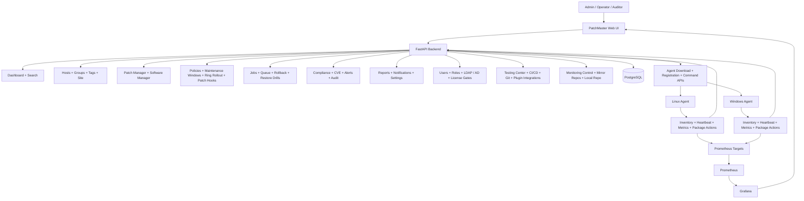

## 2. PatchMaster Feature Workspace Map

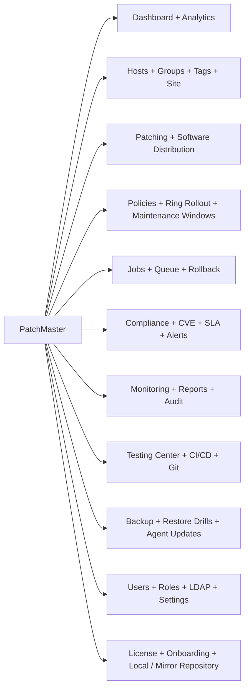

## 3. PatchMaster Endpoint Onboarding And Lifecycle

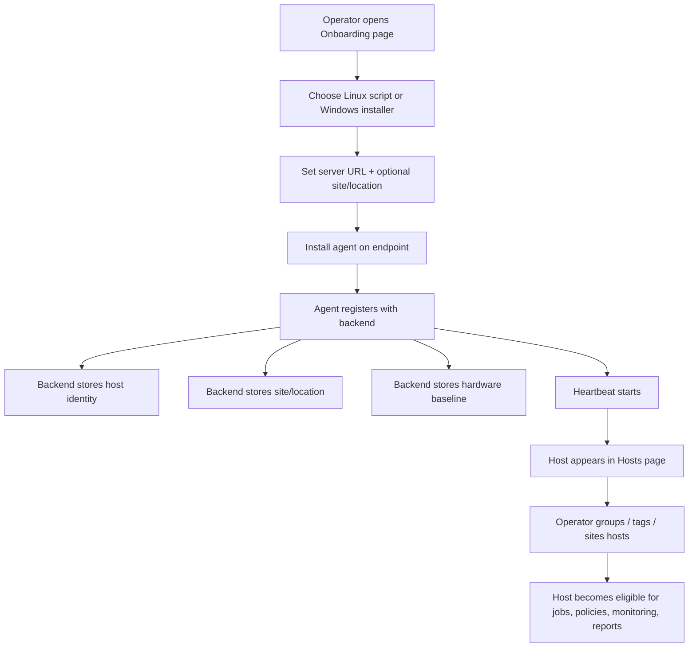

## 4. Patch And Software Distribution Workflow

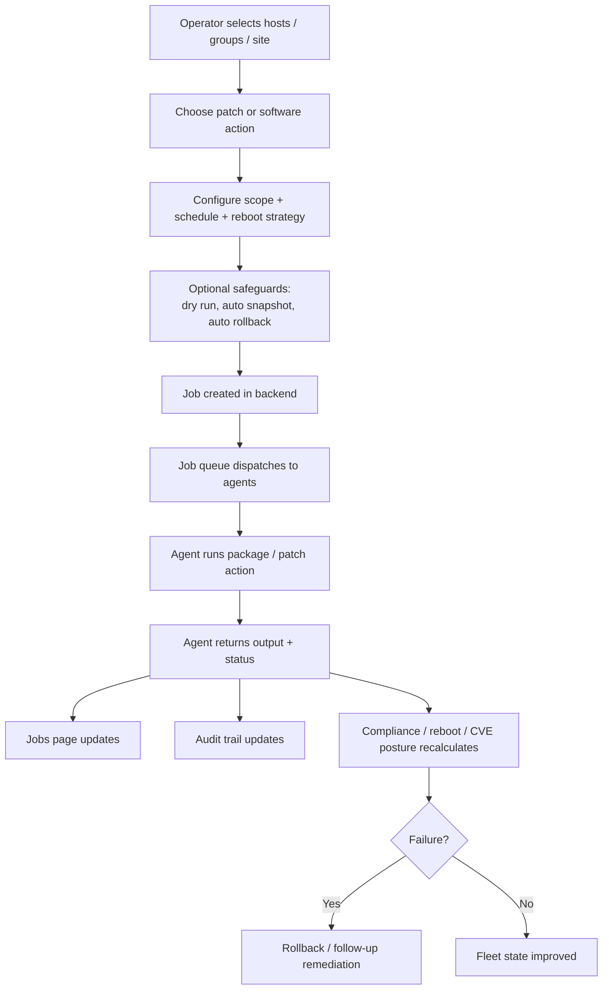

## 5. Monitoring, Testing, And Operational Assurance Flow

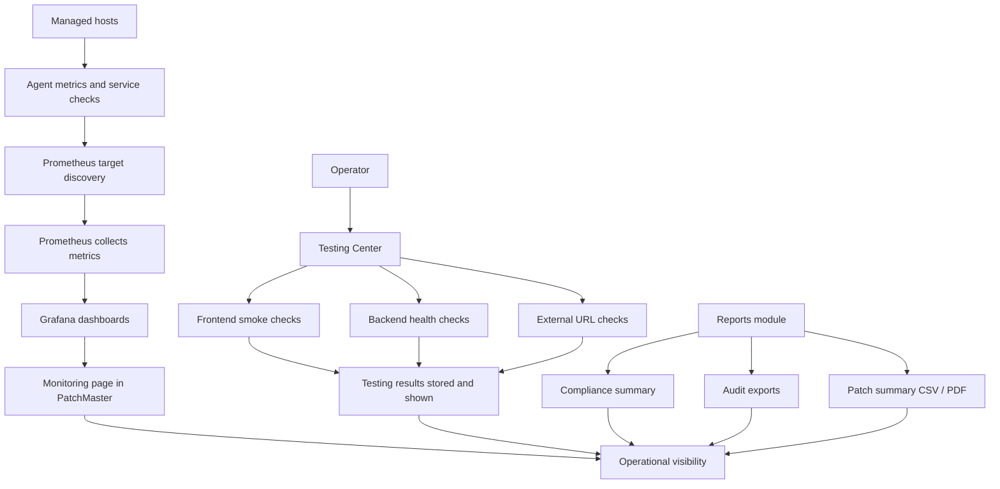

## 6. Governance, Access, And License Enforcement Flow

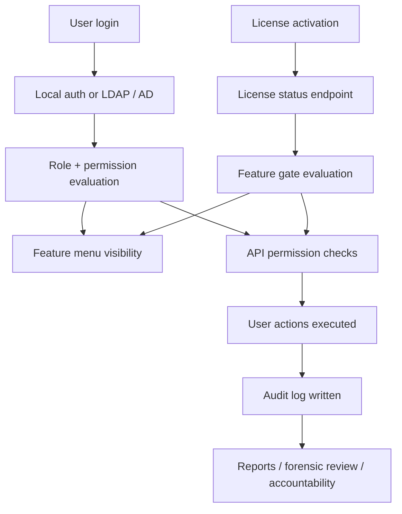

## 7. Vendor Tool Architecture

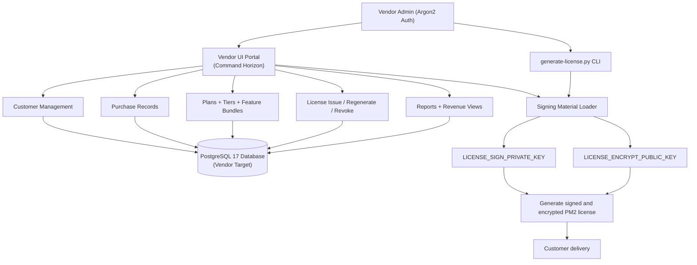

## 8. Vendor Customer And License Lifecycle

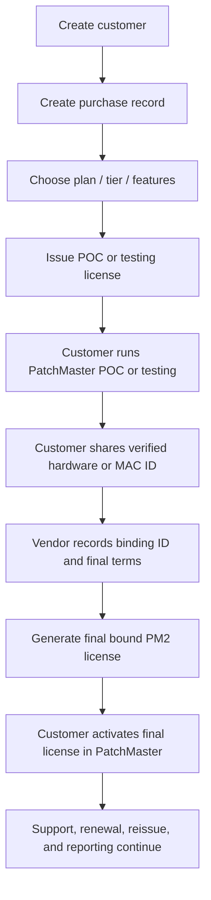

## 9. Build, Packaging, And Deployment Relationship

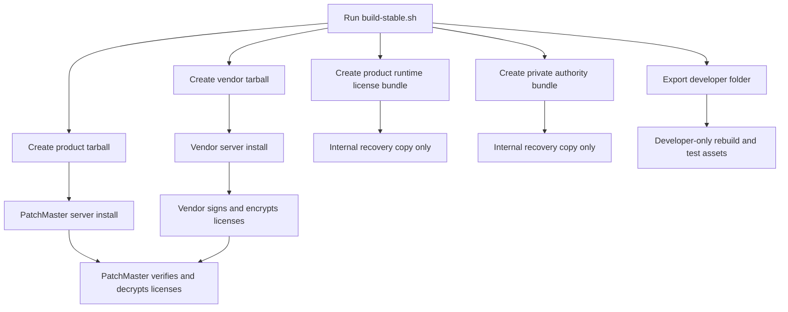

## 10. Runtime Relationship Between Both Tools

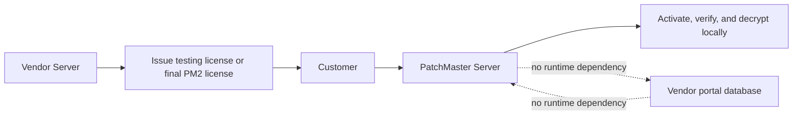

## 11. Security And Trust Boundary

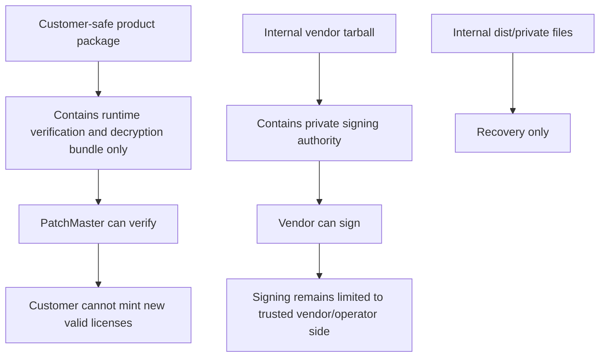

## 12. Exact Usage Instructions

### Internal Build
1. From the repo root run `bash scripts/build-stable.sh`
2. Keep `dist/private/patchmaster-license-authority.env` private
3. Do not share files from `dist/private/` with customers

### PatchMaster Server Install
1. Copy `dist/patchmaster-product-2.0.0.tar.gz` to the PatchMaster server
2. Extract the tarball
3. Run `bash packaging/install-bare.sh --with-monitoring`
4. Let PatchMaster install with the bundled runtime license bundle

### Vendor Server Install
1. Copy `vendor/dist/patchmaster-vendor-2.0.0.tar.gz` to the Vendor server
2. Extract the tarball
3. Run `bash install-vendor.sh`
4. Let Vendor install with the bundled private authority

### After Both Installs
1. Issue a testing license first if you need the customer hardware or MAC ID for final binding
2. Record the verified hardware or MAC ID in the Vendor portal
3. Generate the final `PM2-...` license from the Vendor tool
4. Paste that final `PM2-...` key into PatchMaster

### Important Rules
- PatchMaster and Vendor must share the same license authority set
- customers should receive only customer-safe product artifacts
- the private authority must stay only with your trusted operator/vendor side
- Vendor and PatchMaster are standalone after install, but trust must come from aligned license authority material
- PatchMaster license verification is local; Vendor public internet exposure is not required
