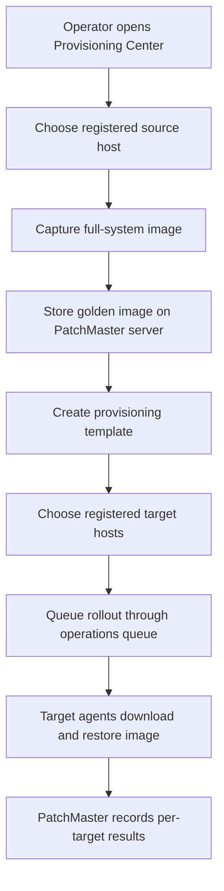
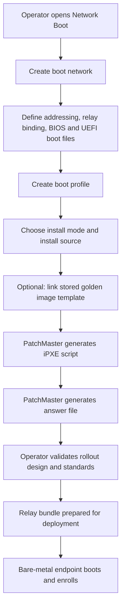
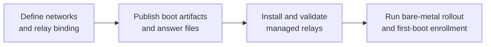
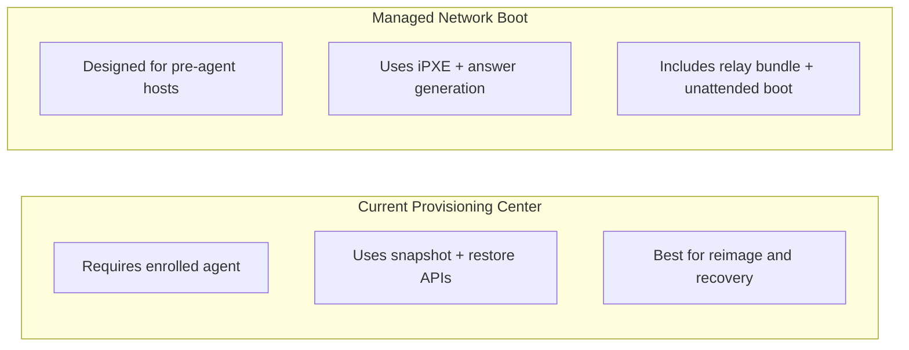
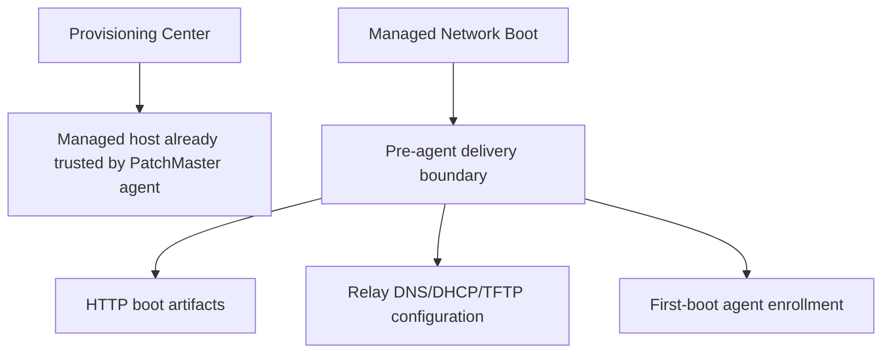

# PatchMaster Provisioning Vs Network Boot

## 1. Current Provisioning Center Flow

## 2. Managed Network Boot Flow

## 3. Managed Relay Workflow

## 4. Current Provisioning Vs Managed Network Boot

## 5. Trust And Delivery Boundary

## Operator Instructions

1. Use `Provisioning Center` for live image rollouts to already-enrolled endpoints.
2. Use `Network Boot` to define rollout standards, boot networks, install profiles, and relay bindings.
3. Preview generated iPXE and answer templates, then validate the managed relay configuration before rollout.
4. Treat `Network Boot` as the live bare-metal workspace for managed-relay deployment.
